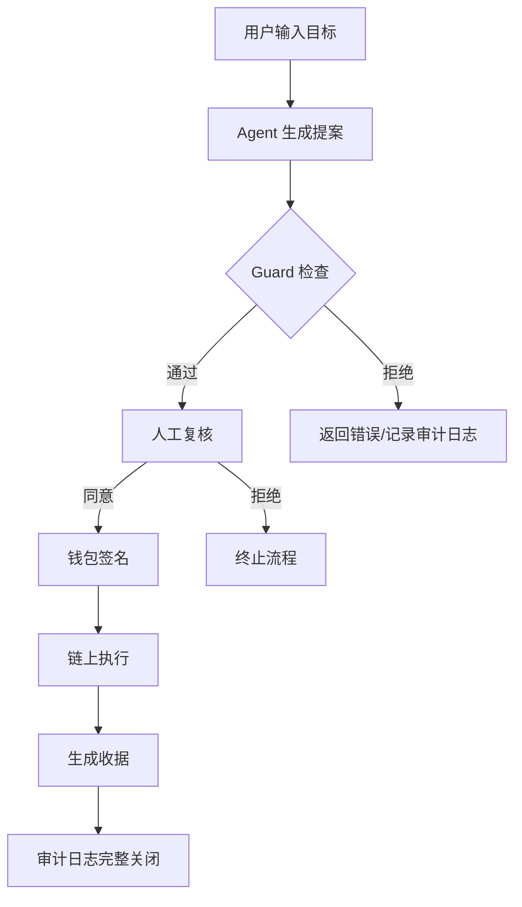

# 模块 C 最小交叉实验 — 流程图

## 核心链路（不变）

## 安全检查点（Human-in-the-loop）

| 检查点 | 执行者 | 说明 |
|--------|----------|-------|
| Guard 规则检查 | 系统 | 目标地址、金额、方法、模拟结果 |
| 人工复核 | 人类 | 对交易草稿的目的、合理性做出最终判断 |
| 钱包签名 | 人类 | Agent 永远不直接掌握签名私钥 |
| 收据验证 | 系统 | 将交易哈希、执行结果写入审计日志 |

## Week 2 增强点

1. **Budget 层（新增）**: Agent 生成提案前，先检查今日预算是否足够
2. **Quote 层（新增）**: 调用外部 API 获取数据时，先获取服务方报价，确认后才执行
3. **AI Security 层（新增）**: Agent 读取的合约文档、网页内容标记为 untrusted context
