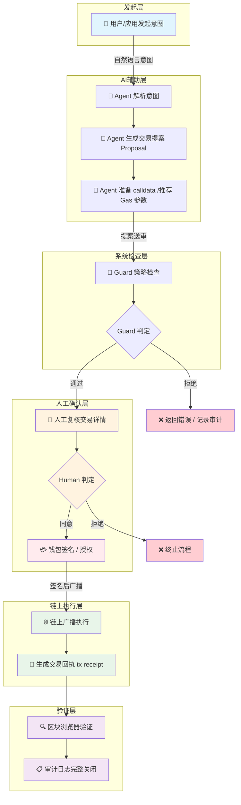

# Week 1 综合任务 | AI × Web3 最小交叉流程图

> 作者：Neo（GitHub: NeoWeb3Nova）
> 时间：2026-05-26
> 所属：AI × Web3 School 共学营 Cohort 0 Week 1
> 标签：#AIxWeb3School #Week1 #AgenticTransaction

---

## 1. 流程图

### 1.1 核心链路（详细版）



### 1.2 角色与执行者对照

| 步骤 | 发起者 | 执行者 | 说明 |
|-------|---------|---------|-------|
| 1. 发起意图 | 用户 / DApp | 用户 | 人类确定目标，AI 不能自发发起交易 |
| 2. 意图解析 | 系统 | AI Agent | LLM 理解自然语言转为结构化需求 |
| 3. 生成提案 | 系统 | AI Agent | 包括目标地址、方法、参数、预估 Gas |
| 4. Guard 检查 | 系统 | Guard / 策略引擎 | 白名单、预算上限、模拟执行验证 |
| 5. 人工复核 | 系统推送 | 人类（必须） | 最后一道人类判断 |
| 6. 钱包签名 | 系统待签 | 人类（必须） | Agent 永不碰私钥 |
| 7. 链上执行 | 签名后自动 | 链上节点 / 矿工 | 去中心化执行 |
| 8. 验证收据 | 自动触发 | 系统 + 人类 | 区块浏览器 + 审计日志 |

---

## 2. 流程说明（3–5 句话）

### 2.1 这个流程解决什么问题

AI Agent 能够理解用户自然语言意图、自动构建结构化交易提案和 calldata，但链上操作的不可逆性和金融风险要求必须有明确的**权限边界**。本流程解决的核心问题是：**如何在让 AI 最大化辅助效率的同时，确保每一笔链上支付都经过人类确认，且私钥永远不离开用户的安全区域。**

### 2.2 哪些步骤由 AI / Agent 辅助

- **意图解析**：LLM 将用户自然语言转换为结构化的交易需求（目标地址、方法、参数）
- **提案生成**：Agent 基于目标查询合约 ABI、生成正确的 calldata，并推荐合理的 Gas Limit 和 Gas Price
- **推荐优化**：在用户去实际签名前，Agent 可以预模拟执行结果并告知用户估算影响

### 2.3 哪些步骤必须人工确认

- **Guard 检查通过后的人工复核**：必须。Guard 是系统层策略，无法处理模糊意图和判断人类主观价值，人类复核是最后一道安全门。
- **钱包签名**：必须。Agent 永远不直接掌握私钥。签名动作发生在用户本地设备的钱包内，Agent 只是传递待签名的消息。

### 2.4 如何验证最终结果

- **瞬时验证**：交易提交后，系统自动读取 tx hash，在区块浏览器（如 BaseScan Sepolia）查询确认交易状态为 Success 或 Confirmed。
- **状态验证**：如果交易是合约调用，在区块浏览器上检查 Event Logs 和更新后的合约状态，确认执行结果与预期一致。
- **审计追溯**：将 tx hash、执行前后状态、审批记录完整写入不可篡改的审计日志，保留永久可查证的记录。

### 2.5 主要风险点

| 风险点 | 描述 | 对策 |
|-------|-------|-------|
| **Agent 幻觉（Hallucination）** | LLM 可能生成错误的目标地址、方法名或参数，导致资金转移到错误地址 | 白名单 + calldata 校验 + 人工复核 |
| **Guard 被绕过** | 策略引擎存在漏洞或配置错误 | 审计日志强制记录 + Guard 更新机制 |
| **私钥泄露** | Agent 或中间件获取了钱包私钥 | 私钥从不离开本地设备，Agent 仅提交待签名的消息 |
| **交易反转且 Gas 不退** | 链上执行失败但 Gas 已消耗 | 测试网预执行 + 模拟验证后才进入主网 |
| **中间人 / 钓鱼攻击** | 恶意网页窃取用户签名请求，或替换 calldata | HTTPS 固定 + calldata 哈希校验 + 签名前展示明确提示 |

---

## 3. 安全边界设计原则

```
Agent 永远只有「提案权」，没有「签名权」
    ↓
私钥隔离 → 签名隔离 → 网络隔离 → 回滚检查
```

---

## 4. 相关链接

- GitHub 学习仓库：https://github.com/NeoWeb3Nova/neo-ai-web3-school-cohort-0
- 模块 C 原型：`experiments/module-c/`
- 本文件：`submissions/week1-ai-web3-minimal-cross-flow.md`

---

> 免责声明：本流程图及说明仅用于学习交流，不构成任何投资建议。实际生产环境请根据具体场景增强安全审计和保险机制。
