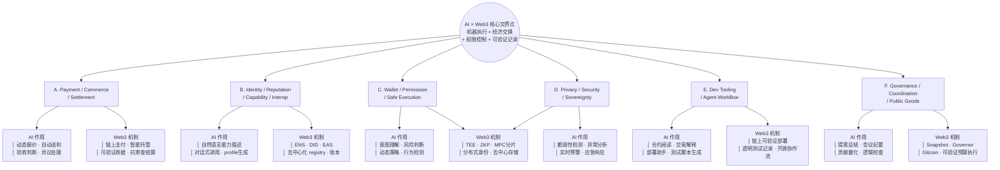

# Week 2｜总交付｜方向深挖包与项目初步 Proposal

> 基于模块 A–G 的全部输出整合而成。主方向：**AI Agent 程序化支付约束与商业闭环（Agent Commerce × PactGuard）**。  
> 作者：Neo（Nova001 搭档）  
> 日期：2026-06-03

---

## 一、AI × Web3 问题地图（6 大方向）

核心判断原则：一个方向成立，必须同时满足 **AI 能力不可替代** + **Web3 机制不可替代**，落在「机器执行 + 经济交换 + 权限控制 + 可验证记录」的交界处。



### 方向速览矩阵

| 方向 | 核心问题 | AI 作用 | Web3 机制 | 典型入口 | 适合类型 |
|------|---------|--------|----------|---------|---------|
| **A. Payment/Commerce/Settlement** | Agent 如何自主购买 API/算力/服务，报价→验收→托管→结算怎么闭环？ | 理解需求、生成报价、自动谈判、监控交付、处理异议 | 链上支付、智能托管(escrow)、可验证收据、清算层、抗审查结算 | x402、MPP、ERC-8183、Cobo CAW | 商业闭环、协议层 |
| **B. Identity/Reputation/Capability** | Agent 如何被发现、描述、验证、协作？ | 自然语言能力描述、任务分解、自动生成 profile/manifest、对话式调用 | ENS、DID、EAS、链上可验证帐本、去中心化能力注册表 | MCP、A2A、ERC-8004、ENS | 协议标准、产品层 |
| **C. Wallet/Permission/Safe Execution** | Agent 接触钱包、签名、链上动作时，权限如何分层、自动化边界在哪？ | 意图理解、风险判断、行为检测、警报生成、复杂策略解释 | 账户抽象(ERC-4337/7702)、智能账户、多签(Safe)、guard/policy、session key、MPC | Safe、Cobo CAW、ERC-4337 | 安全层、协议层 |
| **D. Privacy/Security/Sovereignty** | Prompt injection、tool abuse、敏感数据、私钥暴露、模型供应商依赖如何防御？ | 脆弱性检测、异常行为分析、策略生成、风险预警、审计日志分析 | TEE、零知识证明(ZKP)、分布式身份、密钥分片(MPC)、去中心化存储 | TEE、Oasis、Lit Protocol | 安全机制、权限协议 |
| **E. Dev Tooling/Agent Workflow** | AI 能否真正改善 Web3 builder 工作流？ | 合约阅读、交易解释、部署助手、测试脚本生成、docs-to-agent | 链上可验证部署、透明测试记录、开源协作流 | Codex、Devin、GLM-5.1 | 开发者工具、产品层 |
| **F. Governance/Coordination/Public Goods** | AI 如何辅助 DAO/社区做提案总结、行动项、贡献记录、预算执行？ | 信息整理、会议纪要生成、提案汇总、贡献量化、逻辑检查、翻译提醒 | 公开投票(Snapshot)、链上治理(Governor)、可验证贡献记录(Gitcoin)、透明预算执行 | Snapshot、DAOhaus、Gitcoin | 治理工具、组织协议 |

---

## 二、方向选择说明：Payment / Commerce / Settlement

> **主方向：A — AI Agent 程序化支付约束与商业闭环（Agent Commerce）**

### 为什么不是纯 AI 问题？

纯 AI 可以做自动化支付脚本（调用 Stripe API），但它解决不了这几个根本问题：
- **信任生成**：谁来确保对方会付款？凭什么信任执行任务就一定能收到钱？Agent 作为服务方先执行，消费者撕票怎么办？
- **结算层**：没有先天不可篡改的结算层，机器间的微量交易不可能持续规模化。
- **争议与托管**：结算之后的验收、异议处理、质量评估需要不可篡改的 escrow 和仲裁机制。
- **反审查**：传统支付通道可以被单方面关闭，机器之间的长期商业关系需要抗审查的结算基础设施。

**AI 不能自己生成信任。Web3 的链上托管、可验证收据、抗审查结算是这个方向的刚性约束。**

### 为什么不是纯 Web3 问题？

纯 Web3 可以做转账和托管合约，但没有 AI 的话：
- **动态商业谈判**：买卖双方都是机器，人不在循环里，谁来生成动态报价、谈判服务范围、判断交付是否满意？
- **意图解析**：用户的自然语言需求无法被解析为链上可执行的商业流程。
- **验收与异议**：交付物质量（内容生成、推理结果、设计稿）需要语义理解能力来验收，不是纯规则能扣出来的。
- **多 Agent 协作**：没有智能体对话，机器间的商业交易只能是死的 API 调用，没有商业谈判和任务分解。

**Web3 不能自己生成商业智能。AI 的意图理解、报价生成、交付验收是这个方向的智能层。**

### 核心交界点

**机器对机器的「动态商业谈判 + 不可篡改结算」**。两端缺一不可：
- 缺 AI → 死规则调用，无商业智能；
- 缺 Web3 → 无信任基础，无托管/争议/审计。

---

## 三、问题拆解：Agent Commerce 全链路

### 3.1 参与方

| 角色 | 实体 | 职责 |
|------|------|------|
| **下单者** | 商户 Alice（人类） | 提出需求、确认预算、最终验收 |
| **消费者 Agent** | Alice's Buyer Agent | 发现服务、协商价格、在授权范围内发起付款、获取交付物 |
| **服务提供者 Agent** | ContentGen Provider Agent | 接收任务、执行内容生成、提交交付物、收取款项 |
| **验收者** | Alice + Reviewer Agent（人机结合） | Alice 审核创意与调性；Reviewer Agent 自动扫描违禁词、品牌关键词匹配、完整性校验 |
| **付款方** | Alice's CAW Agent Wallet | 通过 Pact 限制预算、操作范围和时间窗口，在 escrow 中锁定资金 |
| **仲裁者** | 第三方 Evaluator Agent | 当 Alice 与 ContentGen 就"质量是否达标"产生争议时，基于链上交付 hash 和验收标准裁决 |

### 3.2 流程（7 环节）

```
[发现服务] → [报价协商] → [预算授权/托管] → [任务执行] → [交付提交] → [验收评估] → [结算/退款/争议] → [记录归档]
```

| 环节 | AI 作用 | Web3 机制 | 自动化边界 | 人工确认点 |
|------|--------|----------|-----------|-----------|
| **1. 发现/报价** | Agent 读取服务目录，匹配需求（品牌调性、受众、平台），生成推荐 | 服务方在链上/去中心化注册表发布服务卡片（ERC-8004） | ✅ 自动匹配 | 🔒 人类确认预算和服务范围 |
| **2. 预算授权** | Agent 生成 Pact 参数建议 | CAW Pact：金额、合约白名单、链、时间窗口；escrow 锁定资金 | ✅ 自动配置（人类预设模板） | 🔒 人类创建/批准 Pact，存入资金 |
| **3. 任务执行** | Agent 调用内部模型生成内容；若无法完成主动 abort | 执行过程日志 hash 记录 | ✅ 自动执行 | — |
| **4. 交付提交** | 格式化 deliverable（JSON/图文） | 交付物内容 hash 写入链上（ERC-8183 `submit`） | ✅ 自动提交 | — |
| **5. 验收评估** | Reviewer Agent 自动扫描违禁词、关键词覆盖率、完整性 | 链上 hash 比对验证交付物未被篡改 | ✅ 自动层通过后可进入人工层 | 🔒 人类审核调性、创意方向 |
| **6. 结算/退款/争议** | Evaluator Agent 基于规则和数据做裁决建议 | ERC-8183 escrow 释放/退款；超时自动退款（`claimRefund`） | ✅ 自动结算（已预授权范围内）；争议触发人工仲裁 | 🔒 争议裁决由人类或受信 Evaluator 最终确认 |
| **7. 记录归档** | AI 生成审计摘要、声誉更新建议 | 链上 Job 记录 + CAW 审计日志 + x402 Payment Receipt + ERC-8004 声誉输入 | ✅ 自动记录 | — |

### 3.3 AI 作用详细映射

| AI 能力 | 具体作用 | 不可替代性 |
|---------|---------|-----------|
| **意图解析** | 将自然语言需求拆解为链上可执行的商业参数 | 纯 Web3 无法解析 "给我 7 条符合品牌调性的社媒文案" |
| **动态报价与谈判** | 根据市场供需、服务方声誉、任务复杂度生成报价区间 | 死规则无法应对动态服务市场 |
| **交付物验收** | NLP 匹配品牌关键词覆盖率、语义调性判断、违禁词扫描 | 纯合约无法判断 "文案是否够潮" |
| **争议辅助裁决** | 基于交付 hash、历史基准、行业样本生成裁决建议 | 纯代码无法做质量仲裁 |
| **异常行为检测** | 检测高频刷量、渐进式权限试探、Prompt Injection 诱导 | 规则引擎滞后于新型攻击模式 |
| **审计摘要生成** | 将链上 tx + 链下日志聚合为可读审计报告 | 降低人类复盘成本 |

### 3.4 Web3 机制详细映射

| Web3 机制 | 具体作用 | 不可替代性 |
|----------|---------|-----------|
| **x402 / MPP** | HTTP-native 即时微支付，per-request 结算 | 传统支付无法做到机器对机器的无摩擦原子支付 |
| **ERC-8183 (Escrow)** | Job 资金托管、条件释放、超时自动退款、Evaluator 裁决 | 没有链上托管，机器间无法做「先交货后付款」 |
| **ERC-8004 (Reputation)** | Agent 身份注册、历史评分、能力声明 | 去中心化声誉防止刷量和女巫攻击 |
| **CAW Pact** | 预算、范围、时间、频率的程序化约束 | 传统钱包无法给 Agent 设定「临时任务级权限」 |
| **ERC-4337 / Safe** | 账户抽象 + 多签 + Guard，Agent 无签名权但可触发条件执行 | 传统 EOA 无法做策略化自动签名 |
| **链上 Audit Hash** | 交付物、日志、决策的 SHA-256 锚定 | 提供不可篡改的证据链 |

### 3.5 自动化边界 vs 人工确认点

| 可自动化（信息/规则/记录层） | 必须人工（决策/签名/信任层） |
|---------------------------|---------------------------|
| 意图解析、数据获取、风险预检 | 意图的最终确认 |
| 模拟执行（Tenderly/Anvil） | 私钥的触及、预算/范围的突破 |
| 规则校验（Guard/Pact/白名单） | 不可逆或高风险动作（大额、权限变更） |
| 预授权范围内的自动广播 | 异常决策、争议裁决 |
| 链上监听、日志记录 | 新合约首次交互、授权操作 |
| 可自动恢复的失败（Gas bump、滑点调整） | 不可恢复的失败（资金被盗、重大策略偏差） |

### 3.6 验证方式

| 验证层 | 方法 | 验证什么 |
|--------|------|---------|
| **链下自验** | 提案 hash + 模拟执行 | 交易是否会 revert、Gas 是否足够 |
| **Guard 规则验证** | 白名单命中 + 金额阈值 + 方法 ID 校验 | 是否超出授权范围 |
| **人工最终验证** | 用户阅读提案 + 钱包签名 | 意图与结果是否一致 |
| **链上结算验证** | Tx receipt、event log、escrow 状态 | 资金是否按条件释放 |
| **事后审计** | 完整日志（输入 → 推理 → 输出 → 执行结果） | 责任归属与异常追溯 |
| **声誉验证** | ERC-8004 Registry 查询 | 服务方/Agent 历史可信度 |

### 3.7 主要风险

| 风险类型 | 具体表现 | 缓释策略 |
|---------|---------|---------|
| **资金不可逆流失** | 链上转账一旦确认，无中心化回滚 | Escrow 托管 + 条件释放；Pact 单笔/累计/频率硬上限 |
| **Prompt Injection → 恶意支付** | 攻击者通过不可信输入诱导 Agent 转账 | Guard/Policy 硬性边界拦截；上下文隔离（untrusted context 不覆盖系统规则） |
| **渐进式预算耗尽** | 10 × $4.99 快速耗尽 $50 总预算 | v2 Pact 引入 `maxDailyAccumulated` + `maxHourlyFrequency` |
| **伪造工具返回 / 超量定价** | 被劫持服务方返回虚假 402 数据 | `perTransactionMax` 硬编码；独立链上验证 receipt |
| **Session Key 泄露** | Agent 运行环境被攻破，密钥被盗用 | 定时过期、Budget 硬上限、异地使用自动吊销 |
| **交付物质量差但资金已付** | AI 幻觉/调性偏离 | 人机结合验收；Evaluator 裁决；声誉系统长期约束 |
| **权限膨胀诱导** | 社会工程学诱导用户手动放宽 Pact | UI 冷静期 + 多签 + 24h timelock |
| **Facilitator 单点故障** | x402 支付验证服务宕机/被攻破 | Agent 独立向链上验证 receipt，不 sole-source 依赖 Facilitator |

---

## 四、项目初步 Proposal：PactGuard — AI Agent 的程序化支付约束与攻击拦截

### 4.1 三句话电梯演讲

> **问题**：让 AI Agent 自主支付是可行的，但"为谁花钱、花多少、什么时候自动停止"这些边界完全由黑盒 LLM 内部决定，用户无法审查、无法复盘、无法抢救。  
> **方案**：建立一套**可声明的程序化支付约束（CAW Pact）**——在任何支付发生前，Agent 必须在用户预置的预算、合约白名单、时间窗口、频率上限内通过全部检查；违规时自动拒绝、记录审计、触发冷静期。  
> **最小 Demo**：一个 Buyer Agent 通过 x402 协议自动购买 AI 推理服务，在 CAW Pact v2 保护下抵御 8 种攻击场景，拦截率从 v1 的 62.5% 提升至 87.5%，每步操作可审计、可复盘。

### 4.2 目标用户

| 用户类型 | 痛点 | PactGuard 价值 |
|---------|------|---------------|
| **Agent 运营者 / 个人用户** | 希望 Agent 自主采购 API/数据/内容生成服务，但不想每次都手动确认支付，也不想放弃预算控制 | 一次授权、多日自动执行、全程可审计、越权即拦截 |
| **企业级 Agent 推广团队** | 需要让多个 Agent 在已批准的供应商白名单内自主支付，异常时能自动吊销权限 | 白名单 + 频率 + 累计预算多维约束；一键 Pause Guardian |

### 4.3 真实场景

**场景**：商户 Alice 需要为下周促销准备 7 条社交媒体图文。她授权 Buyer Agent 在 $50 USDC 预算内寻找并购买内容生成服务。

- Buyer Agent 发现 ContentGen Provider Agent（营销文案专用 Agent，链上声誉评分 4.7/5）
- 双方通过 ERC-8183 创建 Job，锁定 $50 escrow
- ContentGen Agent 生成内容，交付物 hash 上链
- Reviewer Agent 自动扫描通过（违禁词 0、品牌覆盖率 85%、7 条完整）
- Alice 人工确认调性满意
- CAW Pact 自动释放 escrow 资金
- 交易结果写回 ERC-8004 Reputation Registry

### 4.4 最小功能（MVP）

| 模块 | 功能 | 验证标准 |
|------|------|---------|
| **正常流 Demo** | Buyer Agent 通过 x402 购买 $0.50 AI 推理服务，CAW Pact v2 通过 7 项检查，支付成功，生成 JSON 审计日志 | `python run_demo.py` 能在本地完成端到端运行 |
| **攻击演示** | 模拟 8 种攻击场景（超量定价、额外领取、Prompt Injection 诱导转账、连续低额频繁攻击、过期 Pact、重放、权限膨胀诱导等），展示 v2 Pact 如何在签名前拦截 | 拦截率对比：v1 62.5% → v2 87.5% |
| **审计轨迹** | 每次支付前后生成带时间戳、金额、状态、风险标签的 JSON 日志，用户可审查剩余预算、历史消费、异常告警 | 日志结构清晰、可机器解析、可人工阅读 |
| **多层协议栈展示** | 可视化展示 x402（支付层）+ ERC-8183（商业执行层）+ ERC-8004（身份声誉层）+ CAW Pact（安全约束层）的协作关系 | 架构图 + 代码注释 + README 说清各层边界 |

### 4.5 验证方式（评委/用户如何判断完成）

1. **代码可运行**：`python run_demo.py` 本地完成正常流 + 攻击演示，无需外部 API 密钥。
2. **有效检查**：展示 v2 Pact 在签名前具体拦截了哪些攻击，附带拦截原因。
3. **有审计轨迹**：每次操作生成带时间戳、金额、状态的 JSON 日志，可追溯可审查。
4. **有文档**：README 说清架构、如何运行、与 Cobo 赛道的关联点。

### 4.6 主要风险与 Fallback

| 风险 | 影响 | Fallback |
|------|------|---------|
| x402 Python SDK 未发布 | Server 端不能运行 | 手写 FastAPI mock server，伪造 402 响应和 receipt，重点展示 Client + CAW 逻辑 |
| Base Sepolia USDC 水龙头限额 | 无法获取测试网资金 | 用 Anvil / Hardhat 本地链，或模拟合约交易不上真实链 |
| CAW SDK 未发布 | 无法调用真实 CAW API | 继续使用模拟的 Python `CoboCAWWallet` 类，设计接口与未来 SDK 兼容 |
| 单人参赛工程量过大 | 无法完成全部后端 + UI | 范围锁定在"可演示的最小闭环"，不做真实后端、UI、多链支持 |

### 4.7 可能赛道

| 赛道 | 契合点 |
|------|--------|
| **Cobo Agentic Economy × CAW** | 直接使用 Cobo Agentic Wallet 和 Pact 作为核心安全层，Demo 可参赛 |
| **x402 / Uniswap 基础设施** | 支付层基于 x402，与 ERC-8183 escrow 互补展示完整 Agent Commerce 栈 |
| **A2A / MCP 协议生态** | Buyer Agent 可通过 A2A 发现服务、通过 MCP 调用 Guard 检查，展示跨 Agent 协作 |
| **AI Security / 反 Prompt Injection** | Pact v2 的硬性边界拦截是「模型不可触及的确定性安全层」最佳实践 |
| **ERC-4337 / Safe 智能账户** | 将 CAW Pact 与 Safe Guard 结合，展示账户抽象层的安全策略 |

### 4.8 Week 3 下一步

| 日期 | 目标 |
|------|------|
| D1 (6/4) | 统一 Pact 配置字段，合并 v2 `check_pact()` 逻辑，修复 Time Window Bypass 模拟 |
| D2 (6/5) | 完成本地 mock server，让 client 端到端跑通正常流 + 全部 8 种攻击演示 |
| D3 (6/6) | 撰写 README + 架构图 + 3 分钟 Demo 脚本（正常流 → 攻击演示 → 审计轨迹） |
| D4 (6/7) | 尝试 Base Sepolia 测试网交互，如可行则记录真实 tx hash；若不可行则确定 fallback |
| D5 (6/8) | 最终包装：代码整理、文档检查、Demo 预演 |

---

## 五、参考资料清单（9 条）

| # | 资料 | 类型 | 帮助我判断什么 |
|---|------|------|-------------|
| 1 | **x402 协议白皮书与标准文档**（用户 Obsidian LLM-Wiki `/concepts/x402.md`、`x402-whitepaper-slides.html`） | 协议标准 | 判断「机器支付层」的最小可行形态：x402 只解决「怎么付」，不解决「付完后怎么保证交货」。这帮我确定 x402 应该放在完整 Commerce 栈的哪一层（支付通道层），而不是试图用它解决 escrow 和仲裁问题。 |
| 2 | **ERC-8183 (Trustless Work Agreement)** 标准草案 | 协议标准 | 判断「商业执行层」的骨架： escrow 资金锁定、submit 交付 hash、complete/reject/claimRefund 的状态机、Evaluator 裁决角色。它帮我确认 Agent Commerce 的 7 环节流程设计有标准可依，而非自己拍脑袋。 |
| 3 | **ERC-8004 (Trustless Agents)** 标准草案 + 架构图 | 协议标准 | 判断「身份与声誉层」如何与 Commerce 层衔接：Agent 是谁、信誉如何、能力声明怎么被验证。它帮我确认 Buyer Agent 选择服务方时不能只看价格，还要查链上声誉 Registry。 |
| 4 | **Cobo CAW (Cobo Agentic Wallet) 文档与 Pact 机制** | 工具/基础设施 | 判断「安全约束层」的实现路径：Pact 的任务级授权（预算、范围、时间窗口）是 Agent Wallet 场景下最贴合「反脆弱」思想的权限设计——权限不是静态配置，而是围绕具体任务生成的临时契约，到期即失效。这直接影响 v2 Pact 的设计。 |
| 5 | **Safe Smart Account + Guard 机制文档** | 工具/基础设施 | 判断「账户层」如何承载策略：Safe Guard 的 `checkTransaction`/`checkAfterExecution` 让我理解「策略防火墙」应放在交易执行前后，而非仅依赖模型层的「建议」。这解释了为什么 Pact 检查必须在签名前完成。 |
| 6 | **MCP (Model Context Protocol) vs A2A (Agent-to-Agent) 对比分析**（模块 C 输出） | 协议标准 | 判断「Agent 协作接口」选哪条路径：MCP 解决「Agent 怎么调用工具」（链上查询、Guard 检查），A2A 解决「Agent 之间怎么谈任务、谈价格、谈交付」。两者互补，帮我确定 PactGuard 的技术栈中 MCP 管向内工具、A2A 管向外协作。 |
| 7 | **STRIDE 威胁模型 + 模块 F 攻击模拟结果**（8 种攻击场景，v1 vs v2 拦截率对比） | 方法论/实验数据 | 判断「安全设计是否足够」：v1 的 62.5% 拦截率和 v2 的 87.5% 拦截率是硬数据，A2（超量定价 bypass）和 A5（预算耗尽 bypass）帮我识别 v1 的致命漏洞——单笔限额不等于累计安全。这直接驱动 v2 引入 `maxDailyAccumulated` + `maxHourlyFrequency`。 |
| 8 | **模块 G Governance 流程设计（Grant 全生命周期 AI-人边界）** | 案例/流程设计 | 判断「人机边界」的普适原则：治理场景中的「AI 压缩，人验证」「AI 提醒，人决策」「价值只能人定，资金只能人动」等边界原则，可直接迁移到 Commerce 场景的验收、争议、权限升级环节。 |
| 9 | **Coinbase Commerce + Stripe 传统支付自动化对比** | 商业案例 | 判断「传统自动化 vs Agent Commerce」的根本差异：传统支付只有「支付成功」回执，没有预算控制、交付证明、可验证记录、争议处理。这个反例帮我确认 Agent Commerce 不是「让 Agent 点 Stripe 按钮」，而是四层叠加的新基础设施。 |

---

## 六、附录：未选方向 Backlog（简要说明）

| 方向 | 不选原因 | 后续衔接点 |
|------|---------|-----------|
| B. Identity/Reputation | 需要大规模协作网络效应才能验证价值，单个学员难以做出有感 demo | Payment 闭环跑通后，服务方声誉查询会自然引入 ERC-8004 |
| C. Wallet/Permission | 不单独开线；作为 Payment 任务中的权限控制层深化 | PactGuard 本身就是 Wallet/Permission 在 Commerce 场景下的落地 |
| D. Privacy/Security | 必须做，但作为全方向的安全前提检查（威胁模型已覆盖），而非主线 | v2 Pact 的拦截机制已嵌入安全层设计 |
| E. Dev Tooling | 工作量更大在交叉领域，而非纯开发者工具 | 未来可作为开源工具发布（PactGuard SDK） |
| F. Governance | 距离当前技术栈最远，且需要社区资源才能验证 | 模块 G 已产出完整流程草图，放入 backlog 作为长期方向 |

---

> 项目名：**PactGuard** —— AI Agent 的程序化支付约束与攻击拦截  
> 赛道：Cobo｜Agentic Economy × Cobo Agentic Wallet（可扩展至 x402 / ERC-8183 / Safe 生态）  
> 当前状态：Week 2 方向深挖完成，Week 3 进入 MVP Demo Sprint
