# AI × Web3 问题地图

> Week 2 模块 A 交付：覆盖 6 大交叉方向，标注 AI 作用 × Web3 机制

---

## 可视化问题地图（Mermaid）

在 Obsidian 中查看此笔记时，下方代码块会渲染为图形。

```mermaid
graph TD
    CENTER(("AI × Web3 核心交界点<br/>机器执行 + 经济交换<br/>+ 权限控制 + 可验证记录"))

    CENTER --> A["A. Payment / Commerce<br/>/ Settlement"]
    CENTER --> B["B. Identity / Reputation<br/>/ Capability / Interop"]
    CENTER --> C["C. Wallet / Permission<br/>/ Safe Execution"]
    CENTER --> D["D. Privacy / Security<br/>/ Sovereignty"]
    CENTER --> E["E. Dev Tooling<br/>/ Agent Workflow"]
    CENTER --> F["F. Governance / Coordination<br/>/ Public Goods"]

    A --> A_AI["AI 作用<br/>│ 动态报价 · 自动谈判<br/>│ 验收判断 · 异议处理"]
    A --> A_W3["Web3 机制<br/>│ 链上支付 · 智能托管<br/>│ 可验证收据 · 抗审查结算"]

    B --> B_AI["AI 作用<br/>│ 自然语言能力描述<br/>│ 对话式调用 · profile生成"]
    B --> B_W3["Web3 机制<br/>│ ENS · DID · EAS<br/>│ 去中心化 registry · 账本"]

    C --> C_AI["AI 作用<br/>│ 意图理解 · 风险判断<br/>│ 动态策略 · 行为检测"]
    C --> C_W3["Web3 机制<br/>│ 账户抽象(4337/7702)<br/>│ Safe · guard/policy · MPC · 审计"]

    D --> D_AI["AI 作用<br/>│ 脆弱性检测 · 异常分析<br/>│ 实时预警 · 应急响应"]
    D --> D_W3["Web3 机制<br/>│ TEE · ZKP · MPC分片<br/>│ 分布式身份 · 去中心存储"]

    E --> E_AI["AI 作用<br/>│ 合约阅读 · 交易解释<br/>│ 部署助手 · 测试脚本生成"]
    E --> E_W3["Web3 机制<br/>│ 链上可验证部署<br/>│ 透明测试记录 · 开源协作流"]

    F --> F_AI["AI 作用<br/>│ 提案总结 · 会议纪要<br/>│ 贡献量化 · 逻辑检查"]
    F --> F_W3["Web3 机制<br/>│ Snapshot · Governor<br/>│ Gitcoin · 可验证预算执行"]

    style CENTER fill:#f9f,stroke:#333,stroke-width:4px,color:#000
    style A fill:#e1f5e1,stroke:#333,stroke-width:2px,color:#000
    style B fill:#e1f5e1,stroke:#333,stroke-width:2px,color:#000
    style C fill:#e1f5e1,stroke:#333,stroke-width:2px,color:#000
    style D fill:#e1f5e1,stroke:#333,stroke-width:2px,color:#000
    style E fill:#e1f5e1,stroke:#333,stroke-width:2px,color:#000
    style F fill:#e1f5e1,stroke:#333,stroke-width:2px,color:#000
    style A_AI fill:#fff9c4,stroke:#666,stroke-width:1px,color:#000
    style A_W3 fill:#ffccbc,stroke:#666,stroke-width:1px,color:#000
    style B_AI fill:#fff9c4,stroke:#666,stroke-width:1px,color:#000
    style B_W3 fill:#ffccbc,stroke:#666,stroke-width:1px,color:#000
    style C_AI fill:#fff9c4,stroke:#666,stroke-width:1px,color:#000
    style C_W3 fill:#ffccbc,stroke:#666,stroke-width:1px,color:#000
    style D_AI fill:#fff9c4,stroke:#666,stroke-width:1px,color:#000
    style D_W3 fill:#ffccbc,stroke:#666,stroke-width:1px,color:#000
    style E_AI fill:#fff9c4,stroke:#666,stroke-width:1px,color:#000
    style E_W3 fill:#ffccbc,stroke:#666,stroke-width:1px,color:#000
    style F_AI fill:#fff9c4,stroke:#666,stroke-width:1px,color:#000
    style F_W3 fill:#ffccbc,stroke:#666,stroke-width:1px,color:#000
```

---

## 核心判断框架

一个方向是否成立，不看热词，看 **AI 能力** 与 **Web3 机制** 是否同时不可替代。
真正有价值的问题落在“机器执行 + 经济交换 + 权限控制 + 可验证记录”的交界处。

---

## 方向速览矩阵

| 方向                                        | 核心问题                                               | AI 作用                                              | Web3 机制                                                                  | 典型入口                       | 适合类型      |
| ----------------------------------------- | -------------------------------------------------- | -------------------------------------------------- | ------------------------------------------------------------------------ | -------------------------- | --------- |
| A. Payment/Commerce/Settlement            | Agent 如何自主购买 API/算力/服务，报价→验收→托管→结算怎么闭环？            | 理解需求、生成报价、自动谈判、监控交付、处理异议                           | 链上支付、智能托管(escrow)、可验证收据、清算层、抗审查结算                                        | x402、MPP、ERC-8183、Cobo CAW | 商业闭环、协议层  |
| B. Identity/Reputation/Capability/Interop | Agent 如何被发现、描述、验证、协作？                              | 自然语言能力描述、任务分解、自动生成 profile / manifest、对话式调用、贡献记录总结 | ENS、DID、EAS、链上可验证帐本、去中心化能力注册表(registry)、不可篡改的历史记录                        | MCP、A2A、ERC-8004、ENS       | 协议标准、产品层  |
| C. Wallet/Permission/Safe Execution       | Agent 接触钱包、签名、链上动作时，权限如何分层、自动化边界、人工确认、撤销与审计？       | 意图理解、风险判断、行为检测、警报生成、操作翻译、复杂策略解释                    | 账户抽象(ERC-4337/7702)、智能账户、多签(Safe)、guard/policy、session key、MPC、链上审计记录    | Safe、Cobo CAW、ERC-4337     | 安全层、协议层   |
| D. Privacy/Security/Sovereignty           | Prompt injection、tool abuse、敏感数据、私钥暴露、模型供应商依赖如何防御？ | 脆弱性检测、异常行为分析、策略生成、风险预警、应急响应、审计日志分析                 | TEE、零知识证明(ZKP)、分布式身份、密钥分片(MPC)、去中心化存储、抗审查算法                              | TEE、Oasis、Lit Protocol     | 安全机制、权限协议 |
| E. Dev Tooling/Agent Workflow             | AI 能否真正改善 Web3 builder 工作流？                        | 合约阅读、交易解释、部署助手、测试脚本生成、docs-to-agent、repo 自动维护      | 链上可验证部署、透明测试记录、开源协作流、就地解析合约状态                                            | Codex、Devin、GLM-5.1        | 开发者工具、产品层 |
| F. Governance/Coordination/Public Goods   | AI 如何辅助 DAO/社区做提案总结、行动项、贡献记录、预算执行？                 | 信息整理、会议纪要生成、提案汇总、贡献量化、逻辑检查、翻译提醒                    | 公开投票(Snapshot)、链上治理(OpenZeppelin Governor)、可验证贡献记录(Gitcoin)、透明预算执行、抗审查监督 | Snapshot、DAOhaus、Gitcoin   | 治理工具、组织协议 |

---

## 方向梳理：为什么不是“纯 AI”也不是“纯 Web3”

### 方向 A：Payment / Commerce / Settlement

**为什么不是纯 AI 问题？**
纯 AI 可以做自动化支付脚本（比如用传统支付接口），但它解决不了这几个根本问题：
- 谁来确保对方会付款？凭什么信任执行了任务就一定能收到钱？
- 如果 agent 作为服务提供方先执行，消费者撕票怎么办？
- 没有先天不可篡改的结算层，机器间的微量交易不可能持续规模化。
AI 不能自己生成信任。

**为什么不是纯 Web3 问题？**
纯 Web3 可以做转账和托管合约，但没有 AI 的话：
- 买卖双方都是机器，人不在循环里，谁来生成动态报价、谈判服务范围、判断交付是否满意？
- 结算之后的验收、异议处理、质量评估需要理解能力，不是纯规则能扣出来的。
- 没有智能体对话，机器间的商业交易只能是死的 API 调用，没有商业谈判。

**核心交界点：** 机器对机器的「动态商业谈判 + 不可篡改结算」。

---

### 方向 C：Wallet / Permission / Safe Execution

**为什么不是纯 AI 问题？**
纯 AI 可以做意图识别、风险判断、操作建议，但无法解决：
- AI 运行在某个计算环境中，它的“决策”没有制约力——说“你不能转账”没用，必须有系统级拦截。
- 签名、账户恢复、多签协议是加密算法和分布式共识问题，AI 不能生成信任。
- 钱包的“权限策略”需要在基础设施层执行，而不是模型层“建议”。

**为什么不是纯 Web3 问题？**
纯 Web3 可以做账户抽象、智能账户、左拢链、多签，但没有 AI 的话：
- 用户的自然语言意图无法被解析，只能用古老的“输入地址和金额”方式与链交互。
- 风险是实时变化的，人工规则无法覆盖所有攻击面，需要智能体做行为检测、模式分析、动态策略生成。
- 没有 AI ，“agent wallet”就是一个带固定规则的程序，不能根据语境、供应商、历史行为动态调整权限策略。

**核心交界点：** 智能体的「语境化意图、动态风险判断」与链上「可编程权限、可审计执行」的结合。

---

## 方向判断矩阵（选择 2 个候选后）

| 维度 | 方向 A: Payment | 方向 C: Wallet |
|------|------------------|----------------|
| 结构性需求 | 机器间微付款/结算是长期结构性需求，不是热点趁势 | 智能体触达钱包的权限管理是长期结构性需求 |
| 验证可能性 | 高：demo、流程图、测试网交易记录、日志都可验证 | 高：demo、测试网交易、策略模拟、审计日志都可验证 |
| 最小切入点 | 中：x402 有参考实现，但需要自己搭 paywall + agent + CAW | 低：可以先用测试网钱包做权限策略演示，无需完整 DeFi 交互 |
| 风险边界 | 中：测试网没有真实资金风险，但如果不小心混用主网则风险极高 | 低–中：权限设计只是策略，不涉及自动化交易抛压，安全演示风险较低 |
| 后续承接 | 极高：直接对应模块 B x402+CAW 完整任务，可以进入 Hackathon | 高：可以与模块 D 拉通，但强度不如 Payment 直接 |

---

## 主方向决策：Payment / Commerce / Settlement

> 建议选择 **方向 A: Payment / Commerce / Settlement**

**理由：**
1. **已有资源优势**：你已有 x402 白皮书和相关材料在 LLM-Wiki，课程也把 x402+CAW 作为模块 B 核心任务给出完整链路。
2. **任务集成度最高**：课程很明确地给出了“搭建 x402 paywall + CAW agent 自主支付闭环”的具体指引，后续深挖阻力最小。
3. **安全可控**：全程可在测试网运行，不涉及真实资金。
4. **Hackathon 对接**：Cobo 相关的 Hackathon/workshop 优先应用路径就是 Agent DeFi Execution，而它正是把 Payment + Wallet + Security 放到 DeFi 场景中检验，Payment 是最前置的起点。
5. **性价比**：一周内可以做出有流程图、有测试网交易记录、有参考实现的闭环 demo，验证感最强。

**方向 C (Wallet) 放入 backlog：**
- 相关性很强，但最好在 Payment 闭环跑通后作为“权限控制层”深化，而不是单独开线。
- 理由：“agent 能不能自动付款”这个问题自然会带出“在什么权限范围内付款”，所以 Wallet 会被自然覆盖进去。

---

## 未选方向 Backlog

| 方向 | 不选原因 |
|------|---------|
| B. Identity/Reputation | 需要大规模协作网络效应才能验证价值，单个学员难以做出有感柄的 demo。 |
| C. Wallet/Permission | 不单独开线；作为 Payment 任务中的权限控制层深化。 |
| D. Privacy/Security | 必须做，但作为全方向的安全前提检查，而不是主线。 |
| E. Dev Tooling | 你的工作量更大在交叉领域，而非纯开发者工具。 |
| F. Governance | 距离你当前技术栈最远，且需要社区资源才能验证。 |

---

## 后续行动

1. **即刻启动**模块 B（Payment/Commerce）学习与任务执行。
2. 将其余 2-3 个方向放入 backlog，记录不选原因，避免反复摇摆。
3. 后续模块都围绕 **Payment + x402 + CAW**。

---

> 相关链接: [[Web3 Career Build Week 2]] | [[Web3 Career Build - Study Plan]]
