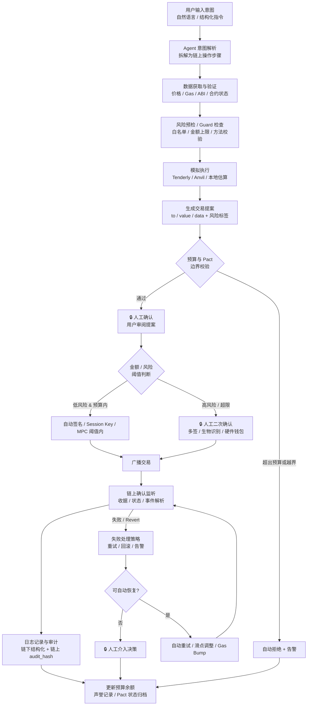

# Week 2｜Wallet / Permission｜Agent 链上动作权限策略

> 基于 Module D「Wallet / Permission / Safe Execution」的三项输出：执行流程图、权限策略设计、核心机制解释。

---

## 一、Agent 发起链上动作的执行流程图

### 1.1 流程图（Mermaid）



### 1.2 可自动化 vs 必须人工确认

| 步骤 | 可自动化 | 必须人工确认 | 说明 |
|------|----------|--------------|------|
| **意图解析** | ✅ | | LLM 将自然语言拆解为操作步骤 |
| **数据获取** | ✅ | | 价格、Gas、ABI、合约状态查询 |
| **风险预检 / Guard** | ✅ | | 白名单命中、金额上限、方法 ID 校验 |
| **模拟执行** | ✅ | | Tenderly / Anvil 验证交易是否会 revert |
| **生成提案** | ✅ | | 输出结构化交易参数 + 风险标签 |
| **预算 / Pact 边界校验** | ✅ | | 硬编码规则自动判断 |
| **用户审阅提案** | | ✅ 🔒 | 人类必须理解并同意将要发生的链上动作 |
| **签名授权** | | ✅ 🔒 | 任何触及私钥或 MPC 签名的环节，人类是最终 root of trust |
| **低风险阈值内执行** | ✅ | | 已在 Pact 中预授权的预算和范围内可自动广播 |
| **高风险 / 超限执行** | | ✅ 🔒 | 金额超限、权限变更、新合约交互必须人工二次确认 |
| **链上监听** | ✅ | | 自动追踪 receipt、事件、状态 |
| **日志记录** | ✅ | | 结构化审计日志自动写入 |
| **可自动恢复的失败** | ✅ | | 滑点超限自动重试、Gas 不足自动 bump |
| **不可恢复的失败** | | ✅ 🔒 | 合约逻辑错误、资金被盗、重大策略偏差需人工决策 |

**关键区分原则**：
- **可自动**：信息收集、规则校验、模拟验证、预授权范围内的执行、事后记录。
- **必须人工**：意图的最终确认、私钥的触及、预算/范围的突破、不可逆或高风险动作、异常决策。

---

## 二、Agent Wallet 场景权限策略设计

### 场景
一个 DeFi Treasury Agent 负责管理团队金库的流动性再平衡任务，在预授权范围内自动执行低风险操作，所有高风险动作受人工和多签约束。

### 策略名称：TreasuryRebalancer Pact v1

#### 2.1 预算（Budget）

| 维度 | 限制 | 说明 |
|------|------|------|
| **每日总预算** | 10,000 USDC | 24h 内所有链上操作累计支出上限 |
| **单次交易上限** | 2,000 USDC | 单笔 swap / supply / withdraw 金额上限 |
| **Gas 预算** | 0.05 ETH/天 | 覆盖 L2 高频操作，主网操作需单独申请 |
| **API 调用预算** | $10/天 | 价格查询、路由计算等链下服务费用 |
| **滑点容忍** | ≤ 2% | 超过自动拒绝并通知 |
| **频率限制** | 每小时最多 4 笔交易 | 防止异常高频刷量 |

#### 2.2 可调用合约（Allowlist）

仅允许与以下已审计合约交互：

| 合约类型 | 具体地址 / 范围 | 状态 |
|----------|----------------|------|
| DEX Router | Uniswap V3 Router（Base / Arbitrum 官方地址） | 白名单 |
| Lending Pool | Aave V3 Pool（Base / Arbitrum 官方地址） | 白名单 |
| Liquid Staking | Lido stETH / wstETH（官方地址） | 白名单 |
| Bridge | 官方 Across / Stargate 合约 | 白名单 |
| 收益聚合器 | Yearn V3 Vault（限已审计列表） | 白名单 |
| **其他所有合约** | 任意未登记地址 | **禁止** |

更新白名单需多签（2/3）通过，并生效 24h 时间锁。

#### 2.3 可执行动作（Action Allowlist）

| 允许动作 | 说明 | 限制 |
|----------|------|------|
| `swapExactTokensForTokens` / `exactInput` | 代币兑换 | 仅限白名单 DEX，金额 ≤ 单次上限 |
| `supply` / `deposit` | 存入流动性 | 仅限白名单 Lending/LSD |
| `withdraw` / `redeem` | 取出流动性 | 仅限已存入的金库 |
| `collectFees` | 收取 LP 费用 | 仅限自有仓位 |
| `approve`（有限额） | 向白名单合约授权 | 授权金额 = 单次交易金额，禁止无限授权 |

| **禁止动作** | 风险等级 | 说明 |
|--------------|----------|------|
| `approve`（无限/最大值） | 🔴 极高 | 禁止 `type(uint256).max` 授权 |
| `transfer` / `transferFrom`（裸转账） | 🔴 极高 | 禁止向非白名单地址转账 |
| `delegatecall` | 🔴 极高 | 禁止代理执行任意代码 |
| `selfdestruct` | 🔴 极高 | 禁止自毁 |
| `upgrade` / `setImplementation` | 🔴 极高 | 禁止代理升级 |
| `vote` / `propose`（治理） | 🟡 高 | 禁止自动参与治理投票 |
| `setGuard` / `changeThreshold` | 🟡 高 | 禁止修改 Safe 自身配置 |

#### 2.4 人工确认阈值（Human-in-the-Loop Thresholds）

| 条件 | 处理方式 | 确认方 |
|------|----------|--------|
| 单笔 ≤ $500，且在 Pact 预算内 | **自动执行** | Agent + Session Key |
| 单笔 $500–$2,000 | **人工一次确认** | 用户通过移动端 / 硬件钱包点击确认 |
| 单笔 > $2,000 | **多签确认（2/3）** | Safe 多签持有人 |
| 与白名单外新合约首次交互 | **强制人工确认 + 24h 冷静期** | 用户 + 多签 |
| 涉及 `approve`（即使有限额） | **人工确认** | 用户 |
| 涉及权限变更（Guard / Policy / Owner） | **多签（2/3）+ 48h 时间锁** | Safe 多签持有人 |
| Gas 估算失败或网络拥堵 | **人工确认** | 用户决定是否提高 Gas |
| 价格偏离预言机 > 5% | **暂停 + 人工确认** | 用户 |

#### 2.5 撤销方式（Revocation & Pause）

| 机制 | 触发方式 | 生效速度 | 影响范围 |
|------|----------|----------|----------|
| **Pact 自动失效** | 时间窗口到期（如 72h） | 自动 | 该 Pact 下所有未执行权限失效 |
| **Session Key 吊销** | 用户通过 CAW 界面点击 Revoke | 即时 | 该 Session Key 立即失效，Agent 需重新申请 |
| **紧急暂停（Pause Guardian）** | 用户或监控机器人触发 | 即时 | 冻结所有 Agent 自动执行，进入纯人工模式 |
| **Safe Guard 移除** | Safe 多签执行 `setGuard(address(0))` | 多签通过后即时 | 完全移除 Agent 的链上策略约束（极端情况） |
| **预算清零** | 用户手动将 Budget 设为 0 | 即时 | Agent 立即失去任何支出能力 |
| **MPC 份额冻结** | 机构钱包管理员操作 | 即时 | 该设备/份额无法参与签名 |

#### 2.6 日志记录（Audit Trail）

| 层级 | 内容 | 存储位置 | 保留期限 |
|------|------|----------|----------|
| **链上基础记录** | Tx Hash、区块号、事件日志、Gas 消耗 | 区块链本身 | 永久 |
| **Safe 事件** | `ExecutionSuccess` / `ExecutionFailure` / `GuardHook` | 链上事件日志 | 永久 |
| **审计日志（结构化）** | 输入意图 → 解析步骤 → 风险标签 → 提案 → 用户确认时间 → 签名者 → 执行结果 → 失败原因 | 本地加密存储 + 可选 IPFS/Arweave | 7 年（合规要求） |
| **CAW Pact 日志** | Pact ID、授权内容、Agent 执行动作、状态变化、异常事件 | Cobo CAW 审计后台 | 按服务商政策 |
| **链上 Audit Hash** | 每条提案的 SHA-256 写入专用日志合约 | 链上 | 永久 |
| **实时告警** | 超预算、异常合约调用、失败率飙升、人工确认超时 | Slack / Telegram / Email | 即时 |

#### 2.7 失败处理（Failure Handling）

| 失败场景 | 检测方式 | 自动处理 | 升级路径 |
|----------|----------|----------|----------|
| **交易 Revert** | 链上 receipt status = 0 | 自动重试最多 2 次（间隔 30s，Gas bump 10%），之后标记失败 | 通知人工，分析 revert reason |
| **Gas 估算失败** | Tenderly / 本地估算返回 error | 暂停执行，不广播 | 人工检查网络状态或合约问题 |
| **滑点超限** | 实际价格偏离预期 > 2% | 自动拒绝交易，记录原因 | 通知人工，是否放宽限制或等待市场稳定 |
| **预算耗尽** | 当日累计支出 ≥ 10,000 USDC | 自动降级为**只读模式**：Agent 可查询、可生成提案，但无法广播任何交易 | 人工申请追加预算或等待次日重置 |
| **Pact 超时** | 超过 `expiredAt` 时间戳 | 自动取消所有待执行提案，未使用资金退回 | 用户重新创建 Pact |
| **Guard 检查失败** | 调用非白名单合约 / 禁止方法 | 立即拦截，不进入签名环节 | 记录告警，通知管理员审查意图 |
| **Session Key 泄露（疑似）** | 异地 / 非常规时间 / 高频异常调用 | 自动吊销 Session Key，触发 Pause Guardian | 人工审查日志，更换 Key，评估损失 |
| **链上确认超时** | 交易 pending > 10 分钟 | Gas bump 20% 替换交易（RBF）1 次，之后标记为 stuck | 人工决定是否加速或取消 |
| **多签持有人离线** | 超过阈值所需签名人无法在 4h 内响应 | 标记为阻塞状态 | 通知备用联系人，或启用备用多签方案 |

---

## 三、ERC-4337、Safe、Guard / Policy 机制的重要性与风险解决

### 3.1 ERC-4337（账户抽象）

**为什么重要**

ERC-4337 是以太坊账户抽象的入口级标准，它解耦了传统 EOA「签名-验证-执行」的刚性绑定。在 ERC-4337 框架下，交易的验证逻辑不再强制是 ECDSA 私钥签名，而可以是任意自定义规则：多签验证、MPC 阈值签名、生物识别、Guard 策略检查、甚至零知识证明。这为 Agent 参与链上动作打开了关键通道——Agent 本身不持有私钥，但可以通过 UserOperation 与智能账户交互，由账户层面的策略决定交易是否合法。

核心组件：
- **UserOperation**：替代传统交易的结构化对象，包含 `callData`、`verificationGasLimit`、`preVerificationGas` 等，允许批量和条件执行。
- **Bundler**：将 UserOperation 打包进区块的专用节点/网络，负责模拟验证并支付 Gas。
- **EntryPoint**：全局可信合约，统一处理验证和执行阶段，确保所有账户遵循相同的安全基线。
- **Paymaster**：可代付 Gas 或允许用 ERC-20 代币支付 Gas，消除新用户必须持有 ETH 的门槛。

**解决的风险**

| 风险类型 | 具体表现 | ERC-4337 如何解决 |
|----------|----------|-------------------|
| **私钥单点失效** | EOA 私钥丢失或被盗 = 资产永久不可恢复 | 支持 Social Recovery、多签、MPC 作为验证方式，不依赖单一私钥 |
| **Gas 支付门槛** | 新用户必须持有 ETH 才能操作 | Paymaster 允许用 USDC 等代币代付 Gas，降低 Agent 自动化场景的摩擦 |
| **无法原生策略控制** | EOA 只能一签一交易，无法嵌入规则检查 | 智能账户可在 `validateUserOp` 中嵌入 Guard / Policy，每笔交易自动过策略引擎 |
| **批量/条件执行困难** | EOA 每次操作都需要单独签名 | 支持批量 UserOperation、条件执行（时间锁、价格触发），适合 Agent 的多步骤任务 |
| **签名设备限制** | 必须依赖硬件钱包或热钱包签名 | 支持任意验证逻辑，包括云端 MPC、生物识别、Passkey，适配 Agent 的无状态部署 |

### 3.2 Safe（智能合约多签钱包）

**为什么重要**

Safe（原 Gnosis Safe）是以太坊上最广泛使用的智能合约多签钱包，它将账户控制权从单一私钥分散到 `n` 个 owner，要求 `m-of-n` 签名才能执行交易。更重要的是，Safe 的**Guard**和**Module**扩展机制允许在交易执行前后插入自定义逻辑，使其从「简单的多签」升级为「可编程的安全容器」。在 Agent 场景中，Safe 常被用作团队金库或 Agent Wallet 的最终执行层——Agent 可以发起提案，但真正的资金挪动必须经过 Safe 的多签或 Guard 检查。

核心组件：
- **Owner / Threshold**：定义谁有权签名，以及需要多少人同意。
- **Module**：可授权外部合约或地址以特定逻辑直接操作 Safe，常用于 Agent 的自动化入口。
- **Guard**：挂载在 Safe 上的「交易防火墙」，在 `checkTransaction`（执行前）和 `checkAfterExecution`（执行后）中运行自定义代码。

**解决的风险**

| 风险类型 | 具体表现 | Safe 如何解决 |
|----------|----------|---------------|
| **单签私钥被盗** | 一个私钥泄露 = 全部资产被盗 | 多签要求 `m-of-n`，单点泄露无法转移资金 |
| **内部作恶** | 团队成员单方转走资金或滥用职权 | Threshold 机制强制多人共识，Guard 可进一步限制可操作范围 |
| **无法审计限制** | 不知道哪些交易被签过，无法限制类型 | 所有交易通过合约执行，事件日志完整；Guard 可强制检查目标地址、金额、方法 ID |
| **密钥丢失后的恢复** | 员工离职或设备损坏导致签名权永久丢失 | Social Recovery Module、继承者机制、Owner 替换流程 |
| **Agent 越权执行** | Agent 被劫持后发起恶意转账 | 将 Agent 设为 Module 或 delegate，但绑定 Guard 策略，限制其操作边界 |

### 3.3 Guard / Policy 机制

**为什么重要**

Guard / Policy 是 Agent Wallet 场景中的「策略防火墙」。如果说 ERC-4337 提供了「可自定义验证」的基础设施，Safe 提供了「多签 + 可扩展账户」的容器，那么 Guard / Policy 就是填充这个容器的**具体规则引擎**。它回答的问题是：Agent 被允许做什么、不允许做什么、在什么条件下需要人工介入、以及违规时如何拦截。

典型实现：
- **Safe Guard**：Solidity 合约，实现 `checkTransaction` 和 `checkAfterExecution`，在 Safe 执行前后运行。例如：只允许向白名单地址转账、单笔金额不超过 X、禁止特定方法 ID。
- **Coinbase Policy Engine**：链下规则引擎，与托管钱包集成，支持围绕地址、金额、时间、频率定义交易政策，违规时自动拦截或触发人工审批。
- **Cobo CAW Pact**：任务级授权，用户围绕一次具体任务定义预算、操作范围、时间窗口和失败处理，Agent 仅在 Pact 边界内获得临时权限，任务结束后权限自动失效。
- **ERC-4337 智能账户 Policy**：在账户抽象层面直接嵌入策略，如 `TimeLockedPolicy`、`SpendingLimitPolicy`、`AllowlistPolicy`，每笔 UserOperation 自动过策略。

**解决的风险**

| 风险类型 | 具体表现 | Guard / Policy 如何解决 |
|----------|----------|-------------------------|
| **Agent 越权调用** | Agent 调用非授权合约或函数 | 白名单 Policy：仅允许与登记的合约地址和函数选择器交互 |
| **预算超支** | Agent 耗尽钱包余额或突破预期支出 | Spending Limit Policy：按时间窗口、单笔、累计维度限制金额，超限自动拦截 |
| **Prompt Injection / API 劫持** | 攻击者通过不可信输入诱导 Agent 执行恶意交易 | Guard 在链上强制执行规则，即使 Agent 推理被污染，链上执行层仍会拒绝违规交易 |
| **长期权限失控** | 一次性授权后 Agent 永久拥有操作权 | 任务级 Pact / Session Key：权限绑定时间窗口和任务边界，到期自动失效；支持即时吊销 |
| **缺乏审计与追责** | 不知道 Agent 做了什么、谁该负责 | Guard 触发的事件日志 + 链下结构化审计，提供完整的「意图 → 提案 → 执行」证据链 |
| **异常行为未感知** | Agent 行为突变（频率、金额、目标异常）未被及时发现 | Policy Engine 支持实时监控和告警：偏离基线时自动暂停并通知人工 |
| **无法回滚已授权操作** | 发现风险后无法撤销 Agent 的权限 | Revocation Registry + Pause Guardian：即时吊销 Session Key、冻结模块、恢复多签控制 |

### 3.4 三者的关系与互补

```
┌─────────────────────────────────────────────┐
│  用户层：Owner / Signer / Human-in-the-Loop  │
├─────────────────────────────────────────────┤
│  策略层：Guard / Policy / Pact / SpendingLimit │  ← 定义 Agent "能做什么"
├─────────────────────────────────────────────┤
│  账户层：Safe Smart Account / ERC-4337 Account │  ← 提供 "可编程验证 + 多签容器"
├─────────────────────────────────────────────┤
│  协议层：ERC-4337 EntryPoint / Bundler / Paymaster│  ← 提供 "账户抽象基础设施"
├─────────────────────────────────────────────┤
│  执行层：Agent / Module / Session Key / MPC   │  ← 发起请求，但不拥有最终签名权
├─────────────────────────────────────────────┤
│  网络层：Ethereum / L2（Base / Arbitrum）    │  ← 最终结算层
└─────────────────────────────────────────────┘
```

**一句话总结**：
- **ERC-4337** 解决「账户如何变得更智能、更灵活」，是基础设施层；
- **Safe** 解决「多人如何安全共管一个智能账户」，是组织层；
- **Guard / Policy** 解决「Agent 在这个账户内的具体边界是什么」，是规则层。

三者叠加，才能在 Agent 参与链上动作时，实现「**自动化效率**」与「**资产安全可控**」之间的可验证、可撤销、可审计的平衡。

---

## 四、设计反思

1. **为什么区分「提案权」和「签名权」还不够？** Module C 中 ProposalGuard 坚持只动嘴不动手，但 Module D 揭示了一个更深的层次：即使 Agent 没有签名权，如果它操作的账户（Module / Session Key / Pact）被配置得太宽松，Agent 的「提案」可能在用户疲劳确认中被自动放行。因此，**权限策略必须同时约束 Agent 的入口（它能发起什么）和账户的出口（Guard 拦截什么），形成双层防御**。

2. **为什么「任务级授权」比「长期授权」更适合 Agent？** 长期授权的问题是授权时无法预见未来所有风险场景，而 Agent 的运行环境（LLM 输入、API 状态、市场价格）持续变化。Pact 模式将授权绑定到「一次任务 + 明确边界 + 时间窗口」，本质上是将**反脆弱**思想注入权限设计：权限不是静态配置，而是围绕具体上下文生成的临时契约，任务结束即失效——这是应对不确定性的最佳策略。

3. **为什么「恢复机制」是自动化的准入门槛？** 模块 D 明确指出：没有恢复机制的自动化不应进入真实资产场景。这对应**奥卡姆剃刀**的逆向应用——不是「如无必要勿增实体」，而是「如无法回滚勿增自动化」。任何自动执行都必须附带暂停、撤销、告警、人工接管的路径，否则系统复杂度带来的风险将超过效率收益。

---

*文件位置*: `tasks/week2-module-d-wallet-permission-safe-execution.md`  
*作者*: Neo（Nova001 的搭档）  
*日期*: 2026-05-30
