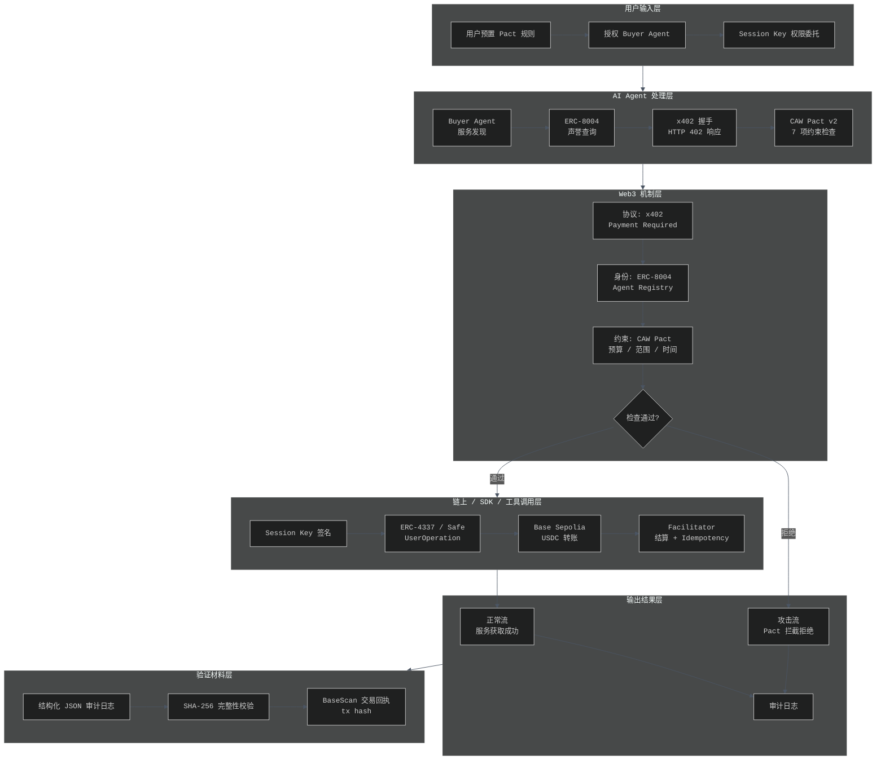

# Week 3 加分挑战 | 项目流程图

> 项目：PactGuard — AI Agent 的程序化支付约束与攻击拦截  
> 赛道：Cobo | Agentic Economy × Cobo Agentic Wallet  
> 作者：Neo  
> 日期：2026-06-03

---

## 一、最小闭环总览

PactGuard 的最小闭环由 **6 个核心层次**构成：

| 层次 | 名称 | 核心作用 |
|-------|------|----------|
| 1 | 用户输入 | 预置 Pact 规则，授权 Agent 与 Session Key |
| 2 | AI Agent 处理 | 服务发现、声誉查询、x402 握手、Pact 检查 |
| 3 | Web3 机制 | x402 协议、ERC-8004 身份、CAW Pact 约束层 |
| 4 | 链上/SDK/工具调用 | Session Key 签名、ERC-4337/Safe、Base Sepolia 执行 |
| 5 | 输出结果 | 服务成功获取 / 攻击被拦截拒绝 |
| 6 | 验证材料 | 结构化审计日志、SHA-256 校验、链上交易回执 |

---

## 二、流程图（Mermaid）

> 提示：若 GitHub 未渲染 Mermaid 图表，请使用交互式 HTML 版本：[`week3-bonus-project-flow-diagram.html`](./week3-bonus-project-flow-diagram.html)

---

## 三、每层详解

### 1. 用户输入层

- **Pact 规则配置**：用户在 `pact-config.json` 中预置支付约束，包括：
  - 预算：`max_usd`, `per_transaction_max`, `daily_limit`
  - 范围：`allowed_contracts`, `allowed_networks`, `deny_functions`
  - 时间：`expires_at`, `allowed_hours`
- **Buyer Agent 授权**：用户向 Agent 授予购买特定服务的权限
- **Session Key 委托**：生成有效期和额度限制的会话密钥，用于后续自动签名

### 2. AI Agent 处理层

- **服务发现**：Buyer Agent 通过 HTTP 请求发现需要支付的服务提供商
- **ERC-8004 声誉查询**：在 Agent Registry 中查询服务提供商的身份与声誉分数
- **x402 握手**：服务端返回 HTTP 402 Payment Required，携带 `X-Payment-Required` 头
- **Pact v2 检查**：对付款请求执行 7 项约束检查（风险识别、合约白名单、额度、时间窗口、频率、重放防护、审计开关）

### 3. Web3 机制层

| 组件 | 协议/标准 | 作用 |
|------|----------|------|
| x402 | HTTP-native 支付协议 | 基于 HTTP 402 状态码的支付握手 |
| ERC-8004 | Agent 身份标准 | 可查询 Agent 的注册身份与历史声誉 |
| CAW Pact | Cobo Agentic Wallet 约束 | 程序化预算/范围/时间/频率限额 |

- **决策分支**：检查通过则进入链上执行流程；检查失败则立即拦截，生成拦截审计日志

### 4. 链上 / SDK / 工具调用层

- **Session Key 签名**：仅在 Pact 允许范围内有效的密钥
- **ERC-4337 / Safe**：通过 UserOperation 或 Safe Smart Account Guard 执行条件签名
- **Base Sepolia**：测试网环境上执行 USDC 转账
- **Facilitator**：结算方完成资金移转，并检查 idempotency 以防止重复扣款

### 5. 输出结果层

- **正常流**：支付成功后，Buyer Agent 获得服务响应（如 AI 内容生成结果）
- **攻击流**：超限、越权、重放、大于市场价等 8 种攻击场景被 Pact 拦截，返回拒绝原因
- **审计日志**：无论成功或失败，每次支付交互均生成完整的 JSON 审计记录

### 6. 验证材料层

- **结构化审计日志**：包含 `audit_id`, `timestamp`, `pact_id`, `tx_hash`, `checks_passed`, `alert_level` 等字段
- **SHA-256 完整性校验**：对单条日志计算哈希，确保事后无法篡改
- **链上回执**：BaseScan 可查询的 tx hash，交易状态、Gas 使用、Token Transfer 详情

---

## 四、闭环设计原则

1. **用户主权**：所有支付规则由用户预置，Agent 不能自主超越范围
2. **程序化拦截**：拦截决策不依赖 LLM 模糊判断，而是基于确定性规则检查
3. **全程审计**：每个环节均产生可复查的审计记录，支持事后复盘
4. **分层解耦**：协议层（x402）、约束层（CAW Pact）、执行层（ERC-4337）独立，便于单独更换或升级
5. **测试网先行**：所有链上交互均在 Base Sepolia 测试网验证，主网交互接口保持一致

---

## 五、关联文件

| 文件 | 路径 | 说明 |
|------|-------|------|
| 交互式流程图 | [`tasks/week3-bonus-project-flow-diagram.html`](./week3-bonus-project-flow-diagram.html) | 可在浏览器打开的暗色 HTML 版本 |
| 架构文档 | [`experiments/x402-caw-agent-payment-loop/architecture.md`](../experiments/x402-caw-agent-payment-loop/architecture.md) | 系统架构分层与状态机 |
| 接口定义 | [`experiments/x402-caw-agent-payment-loop/interfaces.md`](../experiments/x402-caw-agent-payment-loop/interfaces.md) | 5 组关键接口定义 |
| 威胁模型 | [`experiments/x402-caw-agent-payment-loop/threat-model-simulator.py`](../experiments/x402-caw-agent-payment-loop/threat-model-simulator.py) | 8 种攻击场景模拟 |
| 方向卡片 | [`hackathon/direction-card.md`](../hackathon/direction-card.md) | 黑客松方向概述 |

---

*文件位置*: `tasks/week3-bonus-project-flow-diagram.md`  
*作者*: Neo | AI × Web3 School Cohort-0  
*更新日期*: 2026-06-03
